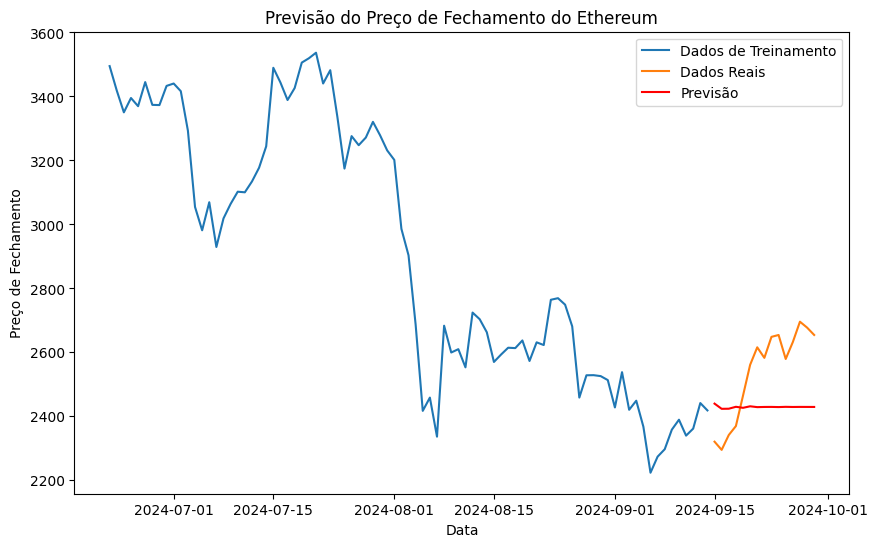
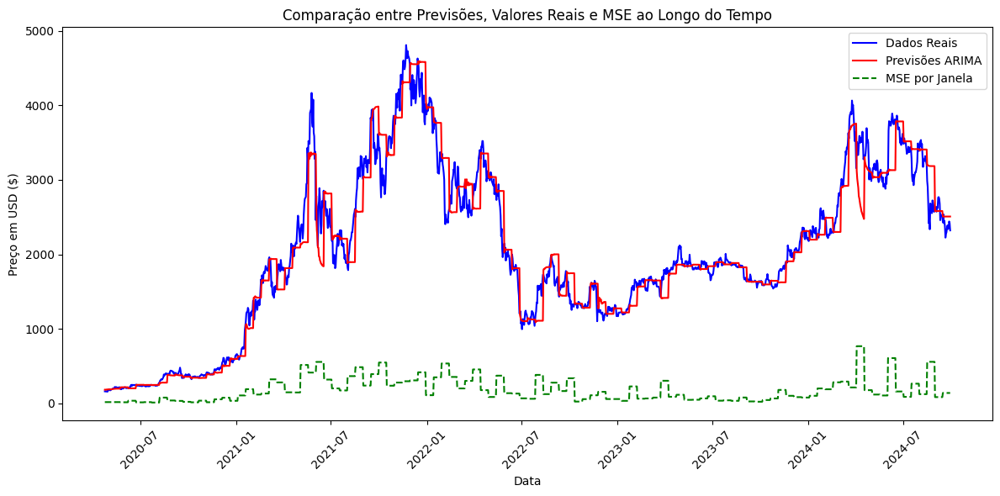
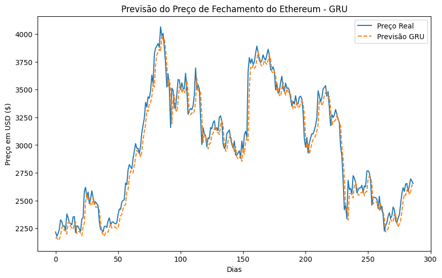
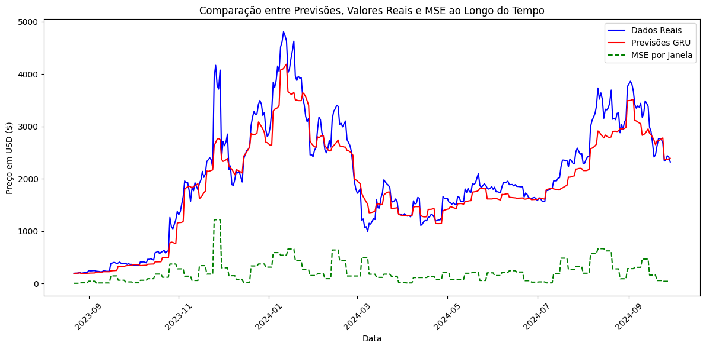
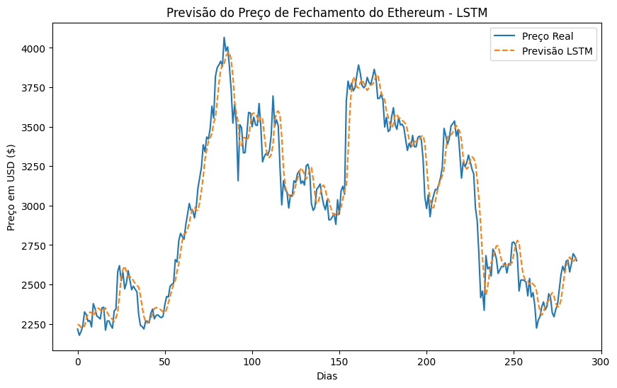
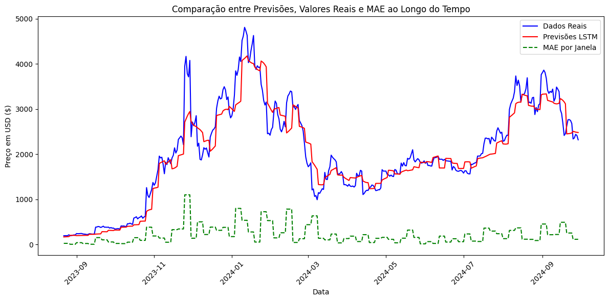

# Análise e Modelagem de Preços do Ethereum

Este repositório contém uma análise detalhada e modelagem de preços do Ethereum (ETH) com três abordagens diferentes: ARIMA, GRU e LSTM. A exploração inicial dos dados é seguida pela implementação e avaliação de cada um desses modelos.

## Estrutura dos Arquivos

```
├── exploration.ipynb
├── models
│   ├── arima.ipynb
│   ├── gru.ipynb
│   ├── lstm.ipynb
│   └── utils.py
└── requirements.txt
```

### Notebooks:

1. **exploration.ipynb**: Contém a exploração inicial dos dados históricos de preços do Ethereum.
2. **arima.ipynb**: Implementação e avaliação do modelo ARIMA.
3. **gru.ipynb**: Implementação e avaliação do modelo GRU.
4. **lstm.ipynb**: Implementação e avaliação do modelo LSTM.
5. **utils.py**: Funções auxiliares para pré-processamento e cálculo de métricas.

---

## 1. Exploração dos Dados (`exploration.ipynb`)

Este notebook é focado na análise exploratória dos dados coletados a partir da API do Yahoo Finance usando `yfinance`. Os dados são filtrados para o período de 01/01/2020 até 18/09/2024, e as seguintes etapas são cobertas:

- Visualização dos preços de fechamento diário.
- Cálculo e visualização de médias móveis (20, 50 e 75 dias) sobre os preços de fechamento.
- Análise do volume de negociação, incluindo a visualização de médias móveis do volume.
- Cálculo da correlação entre preço e volume.
- Cálculo do Índice de Força Relativa (RSI) para analisar condições de sobrecompra e sobrevenda.

Essa exploração ajuda a entender os padrões e comportamentos gerais dos dados antes de aplicar os modelos de previsão.

---

## 2. Modelos de Previsão

### 2.1 ARIMA (`arima.ipynb`)

O modelo ARIMA é um dos modelos estatísticos clássicos usados para modelagem de séries temporais. Aqui, foi implementado um ARIMA simples, seguido de uma otimização usando a função `auto_arima` para buscar os melhores parâmetros.

#### Etapas:
- Treinamento do modelo ARIMA com uma janela de 100 dias e previsão dos próximos 15 dias.
- Avaliação das previsões usando métricas como MAE, MSE, e RMSE.
- Visualização das previsões em relação aos valores reais e a evolução do erro.

#### Resultados:

Previsões iniciais do modelo



Previsões em janelas de tempo


### 2.2 GRU (`gru.ipynb`)

O modelo GRU (Gated Recurrent Unit) é uma rede neural recorrente (RNN) projetada para modelar dependências temporais longas. A abordagem com GRU inclui:

#### Etapas:
- Pré-processamento dos dados usando normalização e criação de sequências de entrada.
- Implementação de uma GRU com duas camadas e treinamento por 50 épocas.
- Previsão dos preços futuros e comparação com os dados reais.
- Cálculo das mesmas métricas de erro usadas no ARIMA e visualização das previsões.

#### Resultados

Previsões iniciais do modelo



Previsões em janelas de tempo



### 2.3 LSTM (`lstm.ipynb`)

Semelhante ao GRU, o modelo LSTM (Long Short-Term Memory) também é uma RNN avançada, capaz de aprender dependências de longo prazo nas séries temporais.

#### Etapas:
- Pré-processamento similar ao GRU, com normalização e sequências de entrada.
- Implementação de uma LSTM com várias camadas e treinamento por 50 épocas.
- Avaliação das previsões com as mesmas métricas (MAE, MSE, RMSE) e visualização das previsões.

#### Resultados:

Previsões iniciais do modelo



Previsões em janelas de tempo



---

## 3. Resultados e Comparações

Cada modelo foi testado em uma abordagem de janela deslizante, onde os dados de treinamento e teste são continuamente atualizados para prever os próximos períodos. No final de cada notebook, são exibidos gráficos comparando os valores reais com as previsões, além das métricas de erro (MAE, MSE e RMSE).

Os notebooks permitem uma análise visual clara do desempenho de cada modelo, mostrando como eles se comportam em diferentes fases do mercado.

---

## Requisitos

Para rodar os notebooks e reproduzir os resultados, você precisará das bibliotecas especificadas no arquivo `requirements.txt`. Para instalar todas as dependências, execute:

```bash
pip install -r requirements.txt
```

---

Com isso, você terá uma visão completa da análise e previsão dos preços de fechamento do Ethereum utilizando três abordagens distintas de modelagem.
